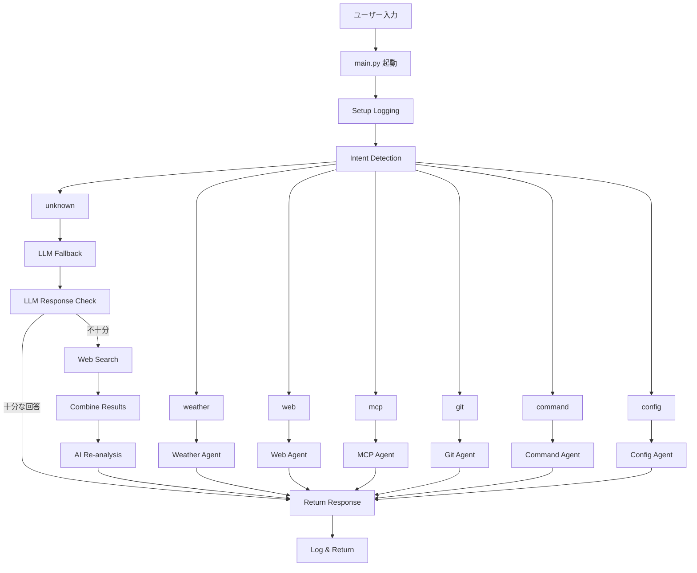
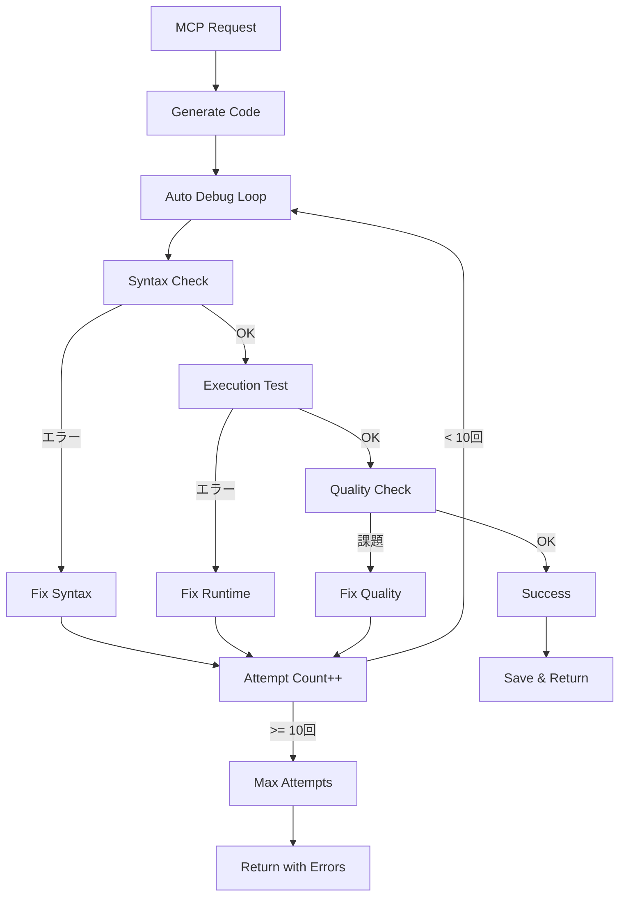
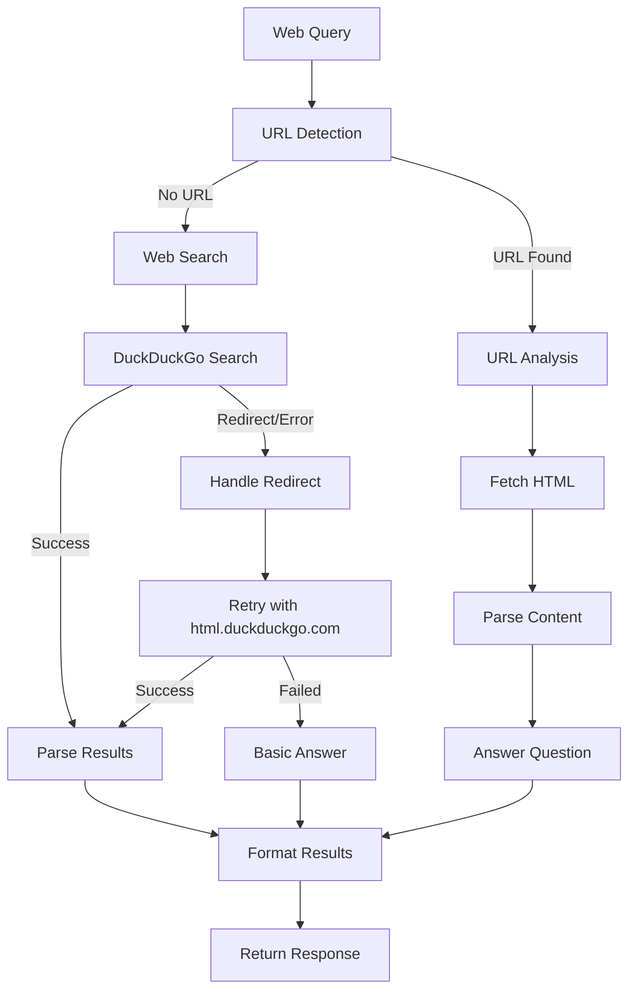

# NeuroHub アーキテクチャ設計書 v2.0

## 🎯 概要

NeuroHubは、複数のAIプロバイダーと統合されたインテリジェントな統一インターフェースシステムです。AI、Web検索、Git、開発ツールを融合し、スマートスピーカーの上位互換を目指します。

## 🏗️ 全体アーキテクチャ

```
┌─────────────────────────────────────────────────────────────┐
│                    NeuroHub Core System                    │
├─────────────────────────────────────────────────────────────┤
│ 🎯 main.py - 統一インターフェース (Unified Interface)        │
│   ├── Intent Detection (意図検出)                           │
│   ├── Agent Routing (エージェント振り分け)                   │
│   ├── Smart Web Fallback (スマートWeb検索フォールバック)     │
│   └── Comprehensive Logging (包括的ログ機能)                │
├─────────────────────────────────────────────────────────────┤
│ 🤖 Agent Layer (エージェント層)                            │
│   ├── 🧠 LLM Agent        │ 🛠️  MCP Agent                    │
│   ├── 🌐 Web Agent        │ 📊 Git Agent                     │
│   ├── 🌤️  Weather Agent   │ ⚙️  Command Agent                │
│   └── ⚙️  Config Agent    │ 💾 Database Agent                │
├─────────────────────────────────────────────────────────────┤
│ 🔧 Service Layer (サービス層)                              │
│   ├── 🎭 AI Services      │ 💽 Database Services             │
│   │   ├── Gemini          │   ├── SQLite                    │
│   │   ├── HuggingFace     │   ├── History Manager           │
│   │   └── Ollama          │   └── Analytics                 │
│   ├── 🌐 Web Services     │ 🔧 MCP Services                  │
│   │   ├── DuckDuckGo      │   ├── Code Generator             │
│   │   ├── BS Parser       │   ├── Project Designer          │
│   │   └── URL Analyzer    │   └── Auto Debugger             │
│   └── 🐙 Git Services     │ 📡 External APIs                │
│       ├── Smart Commit    │   ├── Nature Remo               │
│       ├── Auto Branch     │   ├── Discord Bot               │
│       └── Diff Analysis   │   └── Weather API               │
├─────────────────────────────────────────────────────────────┤
│ 💾 Data Layer (データ層)                                   │
│   ├── 📊 Analytics DB     │ 📁 File Storage                 │
│   ├── 📝 History DB       │ 🗂️  Generated Projects          │
│   ├── 💡 Knowledge DB     │ 📋 Config Files                 │
│   └── 🎯 User Preferences │ 📄 Documentation                │
└─────────────────────────────────────────────────────────────┘
```

## 🔄 実行フロー図

### 1. 統一インターフェース実行フロー



### 2. MCP自動デバッグフロー



### 3. Web検索フロー



## 🧩 主要コンポーネント詳細

### 1. 統一インターフェース (main.py)

#### 🎯 Intent Detector
**責務**: ユーザーの意図を自動検出し適切なエージェントに振り分け

**パターンマッチング**:
```python
patterns = {
    'weather': ['天気', '気温', '降水', '予報', 'weather', 'temperature'],
    'web': ['検索', 'ググ', 'google', 'search', 'トレンド', 'news'],
    'mcp': ['開発', '作成', 'コード', 'プログラム', 'プロジェクト', 'アプリ'],
    'git': ['git', 'commit', 'push', 'pull', 'branch', 'コミット'],
    'command': ['コマンド', '実行', 'execute', 'discord', 'Discord'],
    'config': ['設定', 'config', '環境', 'api key', '何ができる']
}
```

#### 🚀 Agent Router
**責務**: 検出された意図に基づいてエージェントを実行

**実行オプション**:
- `--force-agent`: 特定エージェント強制実行
- `--provider`: LLMプロバイダー指定 (ollama/gemini/huggingface)
- `--debug`: デバッグモード（詳細ログ出力）

### 2. LLMエージェント (agent_llm.py)

#### 🧠 マルチプロバイダー対応
**Gemini API**:
- モデル: gemini-2.5-flash
- 制限: 1日250回
- 特徴: 高速・高品質、日本語対応

**HuggingFace API**:
- モデル: openai/gpt-oss-20b:groq
- 制限: レート制限あり
- 特徴: 中速・安定、英語重視

**Ollama (ローカル)**:
- モデル: カスタム設定可能
- 制限: なし
- 特徴: 低速・無制限、プライベート

#### 📊 履歴管理システム
```sql
llm_history テーブル:
├── session_id (セッション識別)
├── provider (プロバイダー名)
├── model (使用モデル)
├── prompt (入力プロンプト)
├── response (AI応答)
├── success (成功/失敗)
├── response_time (応答時間)
├── input_chars (入力文字数)
├── output_chars (出力文字数)
└── created_at (実行日時)
```

### 3. MCPエージェント (agent_mcp.py)

#### 🛠️ コード生成モード
**5つの実行モード**:
1. **generate**: 単一ファイルコード生成
2. **project**: 複数ファイルプロジェクト作成
3. **debug**: 既存コードデバッグ
4. **optimize**: コード最適化
5. **design**: 設計書・ドキュメント作成

#### 🔄 自動デバッグループ
**3段階修正プロセス**:
1. **構文チェック**: `ast.parse()`による構文検証
2. **実行テスト**: `subprocess.run()`による実行確認
3. **品質チェック**: コード品質・ベストプラクティス確認

**最大10回の修正試行**: エラーが消えるまで自動ループ

#### 💾 プロジェクト管理
- 生成ファイル保存先: `services/mcp/generated_projects/`
- 自動ファイル名生成: プロンプトベース
- 実行権限自動付与: Linux/WSL対応

### 4. Webエージェント (agents/specialized/web_agent.py)

#### 🌐 統合検索機能
**URL解析モード**:
- URL自動検出・抽出
- HTML取得・BeautifulSoup解析
- 質問ベース要約生成

**Web検索モード**:
- DuckDuckGo検索エンジン
- リダイレクト対応強化
- 検索結果5件取得・フォーマット

#### 🔄 フォールバック機能
**基本回答提供**:
- 検索失敗時の基本的回答
- よくある質問への即座対応
- エラー時の適切なメッセージ

### 5. Gitエージェント (agent_git.py)

#### 🐙 スマートGit操作
**自動コミットメッセージ生成**:
- 変更ファイル解析
- 適切なプレフィックス自動選択 (feat/fix/docs/refactor)
- 日本語・英語対応

**安全な操作**:
- aidevブランチ強制
- mainブランチ保護
- 危険コマンド防止

### 6. データベースエージェント (agents/agent_db.py)

#### 💾 知識ベース管理
**3つのテーブル**:
1. **knowledge_base**: 一般知識・FAQ
2. **sql_snippets**: SQL実行可能スニペット
3. **llm_history**: LLM実行履歴

#### 🔍 動的検索
- キーワードベース検索
- 関連度スコアリング
- LLM前の事前知識注入

## ⚙️ 全オプション一覧

### main.py 実行オプション

```bash
python main.py "プロンプト" [オプション]

必須引数:
  prompt                プロンプト文字列

オプション引数:
  -h, --help           ヘルプメッセージ表示
  --force-agent {weather,web,mcp,git,command,config,llm}
                       特定エージェントを強制実行
  --provider {ollama,gemini,huggingface}
                       LLMプロバイダーを指定
  --debug              デバッグモード（詳細ログ出力）

使用例:
  python main.py "今日の天気は？"
  python main.py "Pythonファイル作成" --force-agent mcp
  python main.py "質問" --provider ollama --debug
```

### agent_mcp.py 実行オプション

```bash
python agents/agent_mcp.py [mode] "プロンプト" [オプション]

モード (第1引数、省略可):
  generate             コード生成 (デフォルト)
  project              プロジェクト作成
  debug                既存コードデバッグ
  optimize             コード最適化・改善
  design               設計書・ドキュメント作成

必須引数:
  prompt               プロンプト文字列

オプション引数:
  -h, --help          ヘルプメッセージ表示
  --output OUTPUT     出力ファイル名指定
  --provider {ollama,gemini,huggingface}
                      LLMプロバイダー指定
  --model MODEL       特定モデル名指定

使用例:
  python agents/agent_mcp.py "計算ツール作成"
  python agents/agent_mcp.py generate "ツール作成"
  python agents/agent_mcp.py project "ToDoアプリ" --output todo.py
  python agents/agent_mcp.py debug "コードを修正" --provider ollama
```

### agent_llm.py 実行オプション

```bash
python agents/agent_llm.py "プロンプト" [オプション]

必須引数:
  prompt               プロンプト文字列

オプション引数:
  -h, --help          ヘルプメッセージ表示
  --provider {ollama,gemini,huggingface}
                      LLMプロバイダー指定
  --model MODEL       特定モデル名指定

使用例:
  python agents/agent_llm.py "こんにちはって何語？"
  python agents/agent_llm.py "質問" --provider gemini
  python agents/agent_llm.py "技術質問" --provider huggingface
```

### Web Agent 実行オプション

```bash
python agents/specialized/web_agent.py "プロンプト"

機能:
  URL解析              URLを含むプロンプトでサイト解析
  Web検索             クエリでDuckDuckGo検索

使用例:
  python agents/specialized/web_agent.py "https://example.com 要約"
  python agents/specialized/web_agent.py "Python最新情報"
```

### Git Agent 実行オプション

```bash
python agents/agent_git.py "gitコマンド"

安全機能:
  - aidevブランチ強制チェック
  - 危険コマンド防止
  - 自動コミットメッセージ生成

使用例:
  python agents/agent_git.py "status"
  python agents/agent_git.py "add . && commit -m '修正'"
  python agents/agent_git.py "push origin aidev"
```

## 🔧 環境変数・設定

### 必要な環境変数
```bash
# Google Gemini API
export GOOGLE_API_KEY="your_gemini_key"

# HuggingFace API (OpenAI互換)
export OPENAI_API_KEY="your_hf_key"

# Nature Remo (IoT制御)
export NATURE_REMO_TOKEN="your_remo_token"

# Discord Bot
export DISCORD_TOKEN="your_discord_token"
```

### 設定ファイル
```
config/
├── config.yaml              # メイン設定
├── llm_config.yaml          # LLM設定
├── discord_config.yaml      # Discord設定
├── agent_config.yaml        # エージェント設定
└── prompt_templates.yaml    # プロンプトテンプレート
```

## 📊 ログ・モニタリング

### ログファイル構成
```
logs/
├── neurohub_YYYYMMDD.log    # メインシステムログ
├── mcp.log                  # MCPエージェントログ
├── database.log             # データベース操作ログ
├── weather_agent.log        # 天気エージェントログ
└── git_agent.log           # Git操作ログ
```

### ログレベル
- **DEBUG**: 詳細デバッグ情報 (--debugオプション)
- **INFO**: 通常の動作情報
- **WARNING**: 警告・注意事項
- **ERROR**: エラー・例外情報

## 🚀 パフォーマンス特性

### 応答時間目安
```
LLM (Gemini):        2-5秒    (高速・高品質)
LLM (HuggingFace):   3-8秒    (中速・安定)
LLM (Ollama):        10-30秒  (低速・無制限)
Web Search:          5-15秒   (ネットワーク依存)
MCP Generation:      10-60秒  (複雑さ依存)
Git Operations:      1-3秒    (ローカル操作)
```

### メモリ使用量
- **基本実行**: ~50MB
- **LLM処理**: ~100-200MB
- **MCP生成**: ~150-300MB
- **Web解析**: ~80-150MB

## 🔒 セキュリティ

### APIキー管理
- 環境変数による管理
- .envファイル対応
- コミット除外設定

### 実行制限
- WSL環境推奨
- aidevブランチ強制
- 危険コマンド防止
- ファイル出力先制限

## 📈 拡張性

### 新エージェント追加
1. `agents/` 以下に実装
2. `main.py` の `IntentDetector` にパターン追加
3. `AgentRouter` にルーティング追加
4. テスト作成・実行

### 新プロバイダー追加
1. `services/ai/` 以下に実装
2. 統一インターフェース準拠
3. エラーハンドリング実装
4. 設定ファイル更新

## 🎯 今後の計画

### 短期計画 (1-2週間)
- [ ] NatureRemo API統合
- [ ] Discord Bot機能強化
- [ ] Docker完全対応
- [ ] テストカバレッジ向上

### 中期計画 (1-2ヶ月)
- [ ] 音声認識・合成
- [ ] 画像生成・解析
- [ ] プラグインシステム
- [ ] Web UI開発

### 長期計画 (3-6ヶ月)
- [ ] スマートホーム統合
- [ ] マルチモーダルAI
- [ ] リアルタイム学習
- [ ] クラウド展開

---

*最終更新: 2025年11月3日*
*バージョン: 2.0 - AI統合・Web検索・自動デバッグ対応*
- **Config Agent**: 設定管理（⚠️ DB保存未実装）
- **Git Agent**: 基本Git操作
- **Database Agent**: データベース操作統合管理

### 2. サービス層 (services/)

#### LLMサービス (services/llm/)
- **llm_common.py**: 共通機能・ユーティリティ
- **各プロバイダー実装**: 個別のLLMプロバイダー統合

#### データベースサービス (services/db/)
- **LLM履歴管理** (`llm_history_manager.py`):
  - llm_historyテーブルへの自動記録
  - セッション管理（start_session, end_session）
  - プロバイダー別統計分析
  - 成功率・応答時間・トークン数集計
- **データベース初期化** (`db_initializer.py`): 47テーブル自動作成
- **設定データ管理**: 永続化された設定（⚠️ users.settingsテーブルは定義済みだが、エージェントからの使用は未実装）

#### その他サービス
- **TTS**: テキスト音声変換
- **MCP**: Model Context Protocol対応

### 3. ツール層 (tools/)

#### Agent CLI (agent_cli.py)
- **責務**: 統一されたコマンドラインインターフェース
- **主要機能**:
  - 全エージェントへの統一アクセス
  - チャンク処理コマンド
  - バッチ処理機能

#### 専用ツール
- **Git Commit AI**: AIコミットメッセージ生成
- **Project Organizer**: プロジェクト構造管理
- **Ollama Manager**: Ollamaサーバー管理

## 重要な技術的特徴

### 1. チャンク処理アーキテクチャ

長いテキストを安全に処理するための分散処理システム：

```python
# チャンク処理フロー
テキスト入力 → 文字境界考慮分割 → 並列処理 → 結果統合
```

#### 特徴
- **日本語対応**: 文字境界、句読点、文字種を考慮した分割
- **設定可能サイズ**: 300-500文字（デフォルト）
- **プロバイダー適応**: 各LLMの制限に対応
- **エラー処理**: 部分失敗時の継続処理

### 2. マルチプロバイダー戦略

複数のLLMプロバイダーによる可用性確保：

```
Primary: Gemini (高品質、制限あり)
   ↓ フォールバック
Secondary: HuggingFace (中品質、安定)
   ↓ フォールバック
Tertiary: Ollama (ローカル、無制限)
```

#### 自動フォールバック条件
- API クォータ制限
- レスポンス品質不良
- サーバーエラー
- タイムアウト

### 3. 安全なテキスト処理

#### 文字の折り返し機能
- **日本語対応**: ひらがな・カタカナ・漢字の境界考慮
- **単語境界保持**: 英語単語の分割回避
- **句読点優先**: 自然な区切り位置での改行

#### 入力検証
- **長さ制限**: プロバイダー別の制限値適用
- **文字コード検証**: UTF-8 エンコーディング確保
- **危険文字除去**: 制御文字やマルウェア対策

### 4. 統一レスポンス形式

全LLMプロバイダーからの応答を統一形式で管理：

```python
@dataclass
class LLMResponse:
    status_code: int
    provider: str
    model: str
    content: str
    error: Optional[str]
    metadata: Dict[str, Any]
    # パフォーマンス・デバッグ情報
```

## データフロー

### 1. 標準的なLLMリクエスト

```
CLI入力 → Agent → LLM Service → Provider API → Response → 統一形式 → 出力
```

### 2. チャンク処理フロー

```
長文入力 → チャンク分割 → 並列処理 → 結果統合 → 最終出力
    ↓
各チャンク: Agent → LLM Service → Provider → Response
```

### 3. Git Smart ワークフロー

```
Git変更検出 → ファイル分析 → カテゴライズ → AI要約 → コミットメッセージ生成
```

## 設定管理

### 階層構造
1. **環境変数** (.env): APIキー、機密情報
2. **YAML設定** (config/): 動作設定、プロバイダー設定
3. **プロンプトテンプレート** (prompt_templates.yaml): AI用テンプレート

### 主要設定項目
- **LLMプロバイダー設定**: API エンドポイント、モデル名、制限値
- **チャンク処理設定**: サイズ、オーバーラップ、境界条件
- **Git設定**: 除外パターン、コミット形式
- **安全設定**: 文字制限、タイムアウト値

## エラーハンドリング

### レベル別エラー処理
1. **プロバイダーレベル**: API エラー、制限エラー
2. **エージェントレベル**: ロジックエラー、データエラー
3. **システムレベル**: ネットワークエラー、設定エラー

### 復旧戦略
- **自動リトライ**: 一時的エラーの再試行
- **プロバイダー切り替え**: API障害時の代替手段
- **グレースフル劣化**: 機能制限での継続実行

## パフォーマンス最適化

### 1. キャッシュ戦略
- **プロンプトテンプレート**: メモリキャッシュ
- **設定データ**: ファイル監視による自動リロード
- **LLM履歴**: データベースインデックス最適化

### 2. 並列処理
- **チャンク処理**: 非同期並列実行
- **ファイル分析**: 同時並列処理
- **プロバイダーアクセス**: 負荷分散

### 3. リソース管理
- **メモリ使用量**: チャンクサイズによる制御
- **API クォータ**: 制限値監視と調整
- **ディスク使用量**: ログローテーション

## セキュリティ考慮事項

### 1. 機密情報保護
- **APIキー管理**: 環境変数による分離
- **ログセキュリティ**: 機密情報のマスキング
- **設定ファイル**: 権限制御

### 2. 入力検証
- **文字コード**: UTF-8強制
- **長さ制限**: DoS攻撃対策
- **危険文字**: 制御文字除去

### 3. 出力サニタイズ
- **HTMLエスケープ**: Web出力時
- **パス正規化**: ファイルシステムアクセス
- **コマンドインジェクション**: シェル実行防御

## 拡張性

### 1. 新しいLLMプロバイダーの追加
1. `services/llm/` に実装クラス作成
2. `LLMProviderConfig` を継承
3. 設定ファイルにプロバイダー追加
4. エージェントに統合

### 2. 新しいエージェントの追加
1. `agents/` にエージェントクラス作成
2. CLI インターフェース実装
3. 設定・テンプレート追加
4. テスト・ドキュメント作成

### 3. 新機能の統合
- **プラグインアーキテクチャ**: 動的モジュールロード対応
- **API拡張**: RESTful インターフェース
- **UI統合**: Webインターフェース対応

## モニタリング・デバッグ

### 1. ログ機能
- **階層ログ**: DEBUG/INFO/WARN/ERROR
- **構造化ログ**: JSON形式対応
- **プロバイダー別**: 個別ログファイル

### 2. メトリクス
- **API使用量**: プロバイダー別統計
- **応答時間**: パフォーマンス監視
- **エラー率**: 品質指標

### 3. デバッグツール
- **レスポンス詳細**: デバッグレベル別出力
- **トレース機能**: リクエスト追跡
- **設定検証**: 環境確認ツール

## 今後の改善計画

### 短期 (1-2週間)
- [ ] 全スクリプトへのテキスト折り返し適用
- [ ] 設計書・README更新完了
- [ ] 包括的テストスイート作成

### 中期 (1ヶ月)
- [ ] Web インターフェース開発
- [ ] API サーバー機能追加
- [ ] プラグインシステム実装

### 長期 (3ヶ月以上)
- [ ] 機械学習モデル統合
- [ ] 分散処理対応
- [ ] Enterprise機能追加

## まとめ

NeuroHubは、安全で拡張可能なAI統合システムとして設計されています。チャンク処理による長文対応、マルチプロバイダー戦略による可用性確保、安全なテキスト処理による信頼性を核とした、実用的なAIワークフローシステムです。

---

*最終更新: 2024年12月19日*
*バージョン: 1.0.0*
