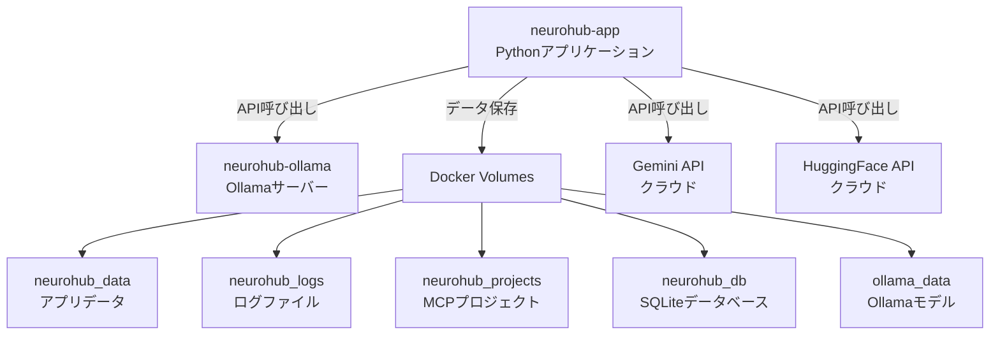

# NeuroHub Docker セットアップガイド

## 🐳 Dockerとは

Dockerは、アプリケーションとその依存関係を**コンテナ**という単位でパッケージ化する技術です。

### NeuroHubでDockerを使うメリット

1. **環境構築が超簡単** 🚀
   - 複雑な手順が `docker-compose up -d` 1コマンドに
   - Python venv、Ollama、データベース、依存関係が全て自動セットアップ

2. **どこでも同じ環境** 🌍
   - Windows、Linux、Raspberry Piで完全に同じ動作
   - 「私の環境では動くのに...」問題の解消

3. **ラズパイ対応** 🥧
   - ARM64/ARM32アーキテクチャ自動対応
   - リソース制限設定で安定動作（メモリ512MB〜2GB）

4. **依存関係の分離** 🔒
   - ホストシステムを汚さない
   - 複数バージョンの共存可能
   - アンインストールも簡単

---

## 📋 前提条件

### 共通
- **Docker Engine**: 20.10以上
- **Docker Compose**: v2.0以上
- **ディスク空き容量**: 最低2GB（推奨5GB以上）
- **メモリ**: 最低2GB（推奨4GB以上）

### Windows環境
- **OS**: Windows 10/11 Pro/Enterprise/Education
- **WSL2**: 有効化必須
- **Docker Desktop**: 最新版

### Linux環境
- **OS**: Ubuntu 20.04+, Debian 11+, Raspberry Pi OS
- **Docker Engine**: 公式リポジトリからインストール
- **Docker Compose**: v2推奨

### Raspberry Pi環境
- **モデル**: Raspberry Pi 4（推奨4GB以上）
- **OS**: Raspberry Pi OS (64-bit推奨)
- **Docker**: 公式スクリプトでインストール

---

## 🚀 インストール手順

### Windows: Docker Desktop

#### ステップ1: WSL2有効化

```powershell
# PowerShellを管理者として実行

# WSL有効化
dism.exe /online /enable-feature /featurename:Microsoft-Windows-Subsystem-Linux /all /norestart

# 仮想マシン機能有効化
dism.exe /online /enable-feature /featurename:VirtualMachinePlatform /all /norestart

# 再起動
Restart-Computer

# WSL2をデフォルトに設定
wsl --set-default-version 2

# 確認
wsl --list --verbose
```

#### ステップ2: Docker Desktop インストール

1. **公式サイトからダウンロード**:
   - https://www.docker.com/products/docker-desktop

2. **インストーラー実行**:
   - `Docker Desktop Installer.exe` をダブルクリック
   - 「Use WSL 2 instead of Hyper-V」を選択

3. **インストール確認**:
```powershell
docker --version
# Docker version 24.0.0 以上

docker-compose --version
# Docker Compose version v2.20.0 以上
```

---

### Linux: Docker Engine

#### Ubuntu/Debian

```bash
# 古いDockerパッケージ削除
sudo apt remove docker docker-engine docker.io containerd runc

# 必要パッケージインストール
sudo apt update
sudo apt install -y \
    ca-certificates \
    curl \
    gnupg \
    lsb-release

# Docker GPG鍵追加
sudo mkdir -p /etc/apt/keyrings
curl -fsSL https://download.docker.com/linux/ubuntu/gpg | sudo gpg --dearmor -o /etc/apt/keyrings/docker.gpg

# Dockerリポジトリ追加
echo \
  "deb [arch=$(dpkg --print-architecture) signed-by=/etc/apt/keyrings/docker.gpg] https://download.docker.com/linux/ubuntu \
  $(lsb_release -cs) stable" | sudo tee /etc/apt/sources.list.d/docker.list > /dev/null

# Dockerインストール
sudo apt update
sudo apt install -y docker-ce docker-ce-cli containerd.io docker-compose-plugin

# Docker起動・自動起動設定
sudo systemctl start docker
sudo systemctl enable docker

# ユーザーをdockerグループに追加（sudoなしで実行可能に）
sudo usermod -aG docker $USER

# ログアウト・ログインして反映
# または
newgrp docker

# インストール確認
docker --version
docker compose version
```

---

### Raspberry Pi: Docker Engine

---

## 🔧 NeuroHub セットアップ

### ステップ1: リポジトリクローン

```bash
# Gitクローン
git clone https://github.com/messpy/NeuroHub.git
cd NeuroHub
```

### ステップ2: 環境変数設定

```bash
# .envファイル作成
cp .env.example .env

# エディタで編集
nano .env  # または vi, vim, code など
```

**.env 最小構成**:
```bash
# Gemini API Key（必須 - 無料: 1日250リクエスト）
# 取得: https://aistudio.google.com/app/apikey
GEMINI_API_KEY=your_gemini_api_key_here

# HuggingFace API Key（推奨 - 無料: 月間制限）
# 取得: https://huggingface.co/settings/tokens
HUGGINGFACE_API_KEY=your_huggingface_token_here

# Ollama設定（自動）
OLLAMA_HOST=http://ollama:11434

# ログレベル
LOG_LEVEL=INFO
```

### ステップ3: Docker起動

```bash
# Docker Compose起動（バックグラウンド）
docker-compose up -d

# 起動確認
docker-compose ps

# 期待される出力:
# NAME                  STATUS              PORTS
# neurohub-app         running (healthy)   0.0.0.0:8000->8000/tcp
# neurohub-ollama      running (healthy)   0.0.0.0:11434->11434/tcp
```

### ステップ4: 初回セットアップ確認

```bash
# ログ確認（初回起動時）
docker-compose logs -f neurohub

# データベース初期化確認
docker-compose exec neurohub ls -la neurohub_llm.db

# テーブル確認
docker-compose exec neurohub sqlite3 neurohub_llm.db ".tables"
```

### ステップ5: 動作確認

```bash
# LLMテスト
docker-compose exec neurohub python3 -c "from agents.agent_llm import LLMAgent; agent = LLMAgent(); print('✅ LLM OK')"

# プロバイダー確認
docker-compose exec neurohub python3 -c "import yaml; config = yaml.safe_load(open('config/llm_config.yaml', 'r', encoding='utf-8')); print('\n'.join([f'{k}: {v.get(\"model\")} (enabled={v.get(\"enabled\")})' for k,v in config.get('llm', {}).get('providers', {}).items()]))"

# Ollama確認
curl http://localhost:11434/api/tags

# テスト実行
docker-compose exec neurohub python3 -m pytest tests/ -v
```

---

## 📊 Docker構成詳細

### コンテナ構成



### ボリューム構成

| ボリューム名 | マウント先 | 用途 | サイズ |
|-------------|-----------|------|--------|
| `neurohub_data` | `/app/data` | アプリケーションデータ | ~100MB |
| `neurohub_logs` | `/app/logs` | ログファイル | ~50MB |
| `neurohub_projects` | `/app/services/mcp/generated_projects` | MCP生成プロジェクト | ~500MB |
| `neurohub_db` | `/app/neurohub_llm.db` | SQLiteデータベース | ~50MB |
| `ollama_data` | `/root/.ollama` | Ollamaモデル | ~1GB〜5GB |

### ポート公開

| ポート | サービス | 説明 |
|--------|---------|------|
| `8000` | neurohub-app | Web UI（将来実装） |
| `11434` | neurohub-ollama | Ollama API |

### リソース制限（docker-compose.yml）

```yaml
deploy:
  resources:
    limits:
      cpus: '2.0'      # 最大CPU 2コア
      memory: 2G        # 最大メモリ 2GB
    reservations:
      cpus: '0.5'      # 最小CPU 0.5コア
      memory: 512M      # 最小メモリ 512MB
```

**Raspberry Pi向け調整**:
```yaml
# Raspberry Pi 4 (4GB) の場合
limits:
  cpus: '3.0'        # 全コア使用
  memory: 3G         # メモリ上限3GB
reservations:
  cpus: '1.0'
  memory: 1G
```

---

## 🎛️ Docker管理コマンド

### 基本操作

```bash
# 起動（フォアグラウンド - ログ表示）
docker-compose up

# 起動（バックグラウンド）
docker-compose up -d

# 停止
docker-compose stop

# 再起動
docker-compose restart

# 完全停止・削除（データは保持）
docker-compose down

# 完全停止・削除（データも削除）
docker-compose down -v
```

### ログ確認

```bash
# 全コンテナのログ
docker-compose logs

# リアルタイムログ（-f: follow）
docker-compose logs -f

# 特定コンテナのログ
docker-compose logs neurohub
docker-compose logs ollama

# 最新100行のみ
docker-compose logs --tail=100 neurohub
```

### コンテナ内操作

```bash
# シェル起動
docker-compose exec neurohub bash

# コマンド実行
docker-compose exec neurohub python3 agents/agent_llm.py
docker-compose exec neurohub python3 -m pytest tests/

# ファイルコピー（ホスト → コンテナ）
docker cp local_file.txt neurohub-app:/app/

# ファイルコピー（コンテナ → ホスト）
docker cp neurohub-app:/app/logs/app.log ./
```

### リソース監視

```bash
# CPU/メモリ使用量
docker stats

# ディスク使用量
docker system df

# コンテナ詳細
docker-compose ps
docker inspect neurohub-app
```

### ボリューム管理

```bash
# ボリューム一覧
docker volume ls

# ボリューム詳細
docker volume inspect neurohub_neurohub_data

# ボリュームバックアップ
docker run --rm -v neurohub_neurohub_data:/data -v $(pwd):/backup ubuntu tar czf /backup/neurohub_backup.tar.gz /data

# ボリューム復元
docker run --rm -v neurohub_neurohub_data:/data -v $(pwd):/backup ubuntu tar xzf /backup/neurohub_backup.tar.gz -C /

# 未使用ボリューム削除
docker volume prune
```

---

## 🔧 トラブルシューティング

### 1. コンテナ起動失敗

**症状**:
```bash
docker-compose up -d
ERROR: ... port is already allocated
```

**解決策**:
```bash
# ポート使用中のプロセス確認
sudo lsof -i :11434  # Ollama
sudo lsof -i :8000   # NeuroHub

# プロセス終了
sudo kill -9 <PID>

# または別ポートに変更（docker-compose.yml）
ports:
  - "11435:11434"  # 11434 → 11435
```

### 2. データベース初期化失敗

**症状**:
```bash
ERROR: database is locked
```

**解決策**:
```bash
# コンテナ再起動
docker-compose restart neurohub

# データベース再初期化
docker-compose exec neurohub python3 scripts/init_database.py

# 最終手段: ボリューム削除・再作成
docker-compose down -v
docker-compose up -d
```

### 3. Ollamaモデルダウンロード失敗

**症状**:
```bash
Error: model not found
```

**解決策**:
```bash
# Ollamaコンテナ内でモデルダウンロード
docker-compose exec ollama ollama pull qwen2.5:1.5b-instruct

# モデル一覧確認
docker-compose exec ollama ollama list

# またはAPI経由
curl http://localhost:11434/api/tags
```

### 4. メモリ不足（Raspberry Pi）

**症状**:
```bash
OOMKilled (Out Of Memory)
```

**解決策**:
```bash
# docker-compose.yml 修正
deploy:
  resources:
    limits:
      memory: 1.5G     # 2G → 1.5Gに削減
    reservations:
      memory: 512M

# 軽量モデルに変更
# .env
OLLAMA_MODEL=qwen2.5:0.5b  # 1.5b → 0.5b
```

### 5. ディスク容量不足

**症状**:
```bash
no space left on device
```

**解決策**:
```bash
# 未使用イメージ削除
docker image prune -a

# 未使用コンテナ削除
docker container prune

# 未使用ボリューム削除（注意: データ消失）
docker volume prune

# 全クリーンアップ
docker system prune -a --volumes
```

### 6. ネットワークエラー

**症状**:
```bash
ERROR: Network neurohub-network declared as external, but could not be found
```

**解決策**:
```bash
# ネットワーク作成
docker network create neurohub-network

# または docker-compose.yml修正
networks:
  default:
    name: neurohub-network
    # driver: bridge  # external削除
```

---

## 📈 パフォーマンスチューニング

### Raspberry Pi向け最適化

**docker-compose.yml**:
```yaml
services:
  neurohub:
    deploy:
      resources:
        limits:
          cpus: '3.0'       # Raspberry Pi 4の全コア
          memory: 3G        # 4GBモデルで3GB割り当て
        reservations:
          cpus: '1.0'
          memory: 1G
    environment:
      # 軽量モデル使用
      - OLLAMA_MODEL=qwen2.5:0.5b
      # ログレベル下げる
      - LOG_LEVEL=WARNING
```

**.env 最適化**:
```bash
# Gemini優先（軽量）
GEMINI_API_KEY=your_key_here
# Ollama無効化（メモリ節約）
OLLAMA_HOST=""
```

### Windows向け最適化

**Docker Desktop設定**:
1. Settings → Resources
2. **CPUs**: 4コア（推奨）
3. **Memory**: 4GB以上（推奨）
4. **Swap**: 2GB
5. **Disk image size**: 60GB

**WSL2メモリ制限** (`.wslconfig`):
```ini
[wsl2]
memory=8GB
processors=4
swap=4GB
```

---

## 🎯 推奨構成

### 最小構成（Raspberry Pi 2GB）

```yaml
# docker-compose.minimal.yml
services:
  neurohub:
    image: neurohub:latest
    deploy:
      resources:
        limits:
          cpus: '2.0'
          memory: 1.5G
    environment:
      - GEMINI_API_KEY=${GEMINI_API_KEY}
      - LOG_LEVEL=WARNING
# Ollama無効化
```

### 標準構成（PC/ラズパイ4GB）

```bash
# デフォルトのdocker-compose.yml使用
docker-compose up -d
```

### フル構成（高性能PC）

```yaml
# docker-compose.full.yml
services:
  neurohub:
    deploy:
      resources:
        limits:
          cpus: '8.0'
          memory: 8G
  ollama:
    # GPU有効化
    deploy:
      resources:
        reservations:
          devices:
            - driver: nvidia
              count: 1
              capabilities: [gpu]
```

---

## 📚 参考資料

- [Docker公式ドキュメント](https://docs.docker.com/)
- [Docker Compose リファレンス](https://docs.docker.com/compose/compose-file/)
- [Ollama Docker](https://hub.docker.com/r/ollama/ollama)
- [DEPENDENCIES.md](DEPENDENCIES.md) - 依存関係詳細
- [README.md](../README.md) - メインドキュメント

curl -fsSL https://get.docker.com -o get-docker.sh
sudo sh get-docker.sh

# 現在のユーザーをdockerグループに追加
sudo usermod -aG docker $USER

# Docker Compose インストール
sudo apt-get update
sudo apt-get install docker-compose-plugin

# 確認
docker --version
docker compose version
```

### 3. NeuroHub起動

```bash
# リポジトリクローン（まだの場合）
git clone https://github.com/messpy/NeuroHub.git
cd NeuroHub

# .envファイル作成（API Keyを設定）
cp .env.example .env
# エディタで.envを編集してAPI Keyを入力

# Docker Composeで起動
docker-compose up -d

# ログ確認
docker-compose logs -f neurohub
```

**これだけで完了！** 🎉

---

## ⚙️ 設定ファイル

### .env（API Key設定）

```env
# Gemini API
GEMINI_API_KEY=your_gemini_api_key_here

# HuggingFace API
HUGGINGFACE_API_KEY=your_huggingface_api_key_here

# Discord Bot（オプション）
DISCORD_BOT_TOKEN=your_discord_bot_token_here
DISCORD_CHANNEL_ID=your_channel_id_here

# ログレベル
LOG_LEVEL=INFO
```

### docker-compose.yml（既に作成済み）

2つのサービスを起動：
- **ollama**: Ollamaサーバー（ポート11434）
- **neurohub**: NeuroHubメインアプリ（ポート8000）

---

## 🔧 よく使うコマンド

### 起動・停止

```bash
# 起動（バックグラウンド）
docker-compose up -d

# 停止
docker-compose down

# 再起動
docker-compose restart

# 完全削除（データも削除）
docker-compose down -v
```

### ログ確認

```bash
# 全サービスのログ
docker-compose logs -f

# NeuroHubのログのみ
docker-compose logs -f neurohub

# Ollamaのログのみ
docker-compose logs -f ollama
```

### コンテナ内でコマンド実行

```bash
# NeuroHubコンテナに入る
docker-compose exec neurohub bash

# Pythonスクリプト実行
docker-compose exec neurohub python3 test_hello_llm.py

# テスト実行
docker-compose exec neurohub pytest tests/ -v
```

### Ollamaモデル管理

```bash
# モデル一覧
docker-compose exec ollama ollama list

# モデルダウンロード
docker-compose exec ollama ollama pull qwen2.5:0.5b-instruct

# モデル削除
docker-compose exec ollama ollama rm <model_name>
```

---

## 🥧 Raspberry Pi固有の設定

### メモリ・CPU制限

`docker-compose.yml`で既に設定済み：

```yaml
deploy:
  resources:
    limits:
      cpus: '2.0'      # 最大2コア使用
      memory: 2G       # 最大2GB RAM
    reservations:
      cpus: '0.5'      # 最低0.5コア確保
      memory: 512M     # 最低512MB RAM
```

### 推奨スペック

| モデル | 推奨 | 最小 |
|--------|------|------|
| Raspberry Pi 4 (4GB) | ✅ 推奨 | - |
| Raspberry Pi 4 (2GB) | ⚠️ 可能 | - |
| Raspberry Pi 3B+ | ❌ 非推奨 | 軽量モデルのみ |

### ラズパイでの起動例

```bash
# Raspberry Pi OS (Debian Bookworm)
cd ~/NeuroHub

# メモリ節約モードで起動
docker-compose up -d

# 軽量モデル使用
docker-compose exec ollama ollama pull qwen2.5:0.5b-instruct
```

---

## 🔍 トラブルシューティング

### 1. "Cannot connect to Docker daemon"

```bash
# Dockerサービス起動
sudo systemctl start docker

# 自動起動設定
sudo systemctl enable docker
```

### 2. "Permission denied" エラー

```bash
# dockerグループに追加
sudo usermod -aG docker $USER

# 再ログイン必要
exit
# 再度SSHまたはターミナル起動
```

### 3. メモリ不足（ラズパイ）

```bash
# スワップ領域追加
sudo dphys-swapfile swapoff
sudo nano /etc/dphys-swapfile
# CONF_SWAPSIZE=2048 に変更
sudo dphys-swapfile setup
sudo dphys-swapfile swapon
```

### 4. Ollama接続エラー

```bash
# Ollamaコンテナ状態確認
docker-compose ps ollama

# Ollamaヘルスチェック
docker-compose exec ollama curl -f http://localhost:11434/api/tags
```

---

## 📊 Docker vs venv 比較

| 項目 | Docker | Python venv |
|------|--------|-------------|
| **セットアップ** | ⭐⭐⭐⭐⭐ 超簡単 | ⭐⭐⭐ 中程度 |
| **環境統一** | ⭐⭐⭐⭐⭐ 完璧 | ⭐⭐ OS依存 |
| **ラズパイ対応** | ⭐⭐⭐⭐⭐ 自動 | ⭐⭐⭐ 手動設定 |
| **メモリ使用** | ⭐⭐⭐ やや多い | ⭐⭐⭐⭐⭐ 最小 |
| **デバッグ** | ⭐⭐⭐ コンテナ内 | ⭐⭐⭐⭐⭐ 直接 |
| **本番運用** | ⭐⭐⭐⭐⭐ 最適 | ⭐⭐⭐ 手動管理 |

### 推奨使い分け

- **開発中**: venv（デバッグしやすい）
- **本番運用**: Docker（安定・簡単）
- **ラズパイ**: Docker（環境統一）
- **チーム共有**: Docker（環境差異なし）

---

## 🔄 アップデート手順

```bash
# 最新コード取得
git pull origin aidev

# イメージ再ビルド
docker-compose build

# 再起動
docker-compose up -d

# 古いイメージ削除（オプション）
docker image prune -f
```

---

## 🛠️ 開発者向け

### カスタムDockerfile

```dockerfile
# 開発用追加パッケージ
FROM python:3.12-slim-bookworm

# ... 既存の設定 ...

# 開発ツール追加
RUN pip install ipython jupyter black ruff mypy
```

### ボリュームマウント

```yaml
# docker-compose.override.yml（Git除外推奨）
version: '3.8'
services:
  neurohub:
    volumes:
      # ホストのコードを直接マウント（開発用）
      - ./agents:/app/agents
      - ./services:/app/services
```

---

## 📖 参考リンク

- [Docker公式ドキュメント](https://docs.docker.com/)
- [Docker Compose](https://docs.docker.com/compose/)
- [Ollama Docker](https://hub.docker.com/r/ollama/ollama)
- [Raspberry Pi + Docker](https://docs.docker.com/engine/install/debian/)

---

*最終更新: 2025年11月2日*
