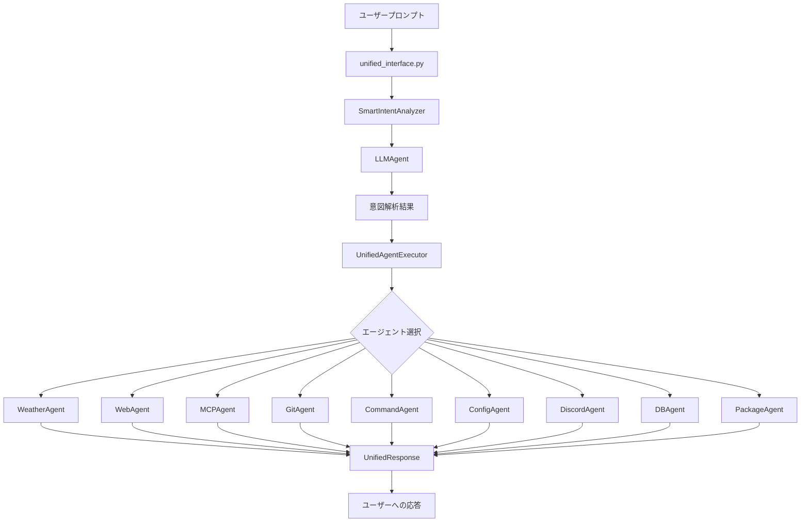
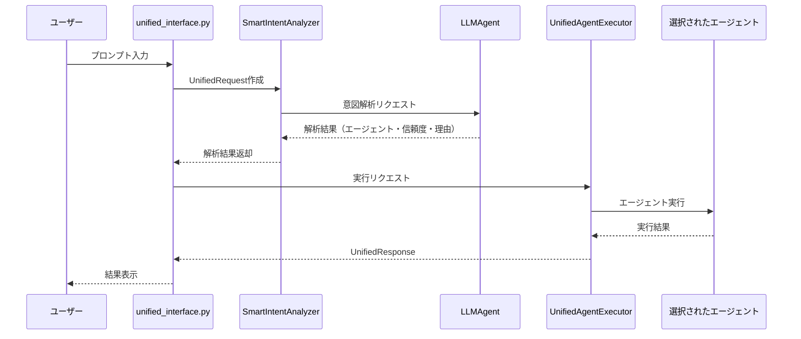

# 🧠 NeuroHub統一インターフェース設計書

> **LLM判断による自動エージェント選択システム**
> 作成日: 2024年
> バージョン: 1.0
> 実装ファイル: `unified_interface.py`

---

## 📋 目次

1. [概要](#概要)
2. [システムアーキテクチャ](#システムアーキテクチャ)
3. [メインフロー](#メインフロー)
4. [LLM意図解析システム](#llm意図解析システム)
5. [対応エージェント](#対応エージェント)
6. [データ形式](#データ形式)
7. [使用例](#使用例)
8. [技術仕様](#技術仕様)
9. [パフォーマンス指標](#パフォーマンス指標)
10. [セキュリティ](#セキュリティ)
11. [拡張性](#拡張性)
12. [実装ステータス](#実装ステータス)

---

## 📋 概要

NeuroHub統一インターフェースは、**ユーザーのプロンプトをLLMで解析し、最適なエージェントに自動ルーティングする次世代AIシステム**です。

### 🎯 主要目標

- ✅ **ユーザーフレンドリー**: エージェントを意識せずに自然言語で操作
- ✅ **高度な意図理解**: LLMによる文脈を考慮した解析
- ✅ **統一された応答形式**: すべてのエージェントから一貫したレスポンス
- ✅ **スケーラブル設計**: 新しいエージェントの簡単な追加
- ✅ **堅牢性**: エラーハンドリングとフォールバック機能

### 💡 コアコンセプト

```
ユーザープロンプト → LLM解析 → 最適エージェント選択 → 実行 → 統一レスポンス
```

---

## 🏗️ システムアーキテクチャ



### アーキテクチャ層

| 層 | 説明 | 実装 |
|---|-----|------|
| **🖥️ ユーザーインターフェース層** | CLI/Web/API統合インターフェース | `unified_interface.py` |
| **🔍 意図解析層** | LLMベース自動解析システム | `SmartIntentAnalyzer` |
| **⚙️ 実行制御層** | ルーティング・実行管理 | `UnifiedAgentExecutor` |
| **🤖 エージェント層** | 各種専門エージェント | 9種類のエージェント |

---

## 🔄 メインフロー

### シーケンス図



### 詳細フロー

```
📥 1. ユーザープロンプト受信
   ├─ プロンプト検証
   ├─ UnifiedRequest作成
   └─ セッション管理

🔍 2. SmartIntentAnalyzer実行
   ├─ LLMAgent呼び出し
   ├─ 解析プロンプト構築
   ├─ LLM推論実行
   ├─ JSON結果パース
   ├─ フォールバック処理
   └─ 信頼度・理由・パラメータ抽出

⚙️ 3. UnifiedAgentExecutor実行
   ├─ エージェント選択
   ├─ パラメータ準備
   ├─ エージェント呼び出し
   ├─ 実行時間計測
   ├─ エラーハンドリング
   └─ 実行履歴保存

📤 4. UnifiedResponse生成
   ├─ 成功/失敗ステータス
   ├─ 使用エージェント名
   ├─ レスポンス内容
   ├─ メタデータ（解析結果・実行時間）
   └─ タイムスタンプ
```

---

## 🔍 LLM意図解析システム

### SmartIntentAnalyzer

**高度なLLMベース意図解析エンジン**

```python
class SmartIntentAnalyzer:
    def analyze(self, prompt: str, context: Dict[str, Any] = None) -> Dict[str, Any]:
        """
        LLMを活用した高度な意図解析

        Returns:
            - agent: str           # 選択されたエージェント名
            - confidence: float    # 信頼度 (0.0-1.0)
            - reasoning: str       # 選択理由
            - parameters: dict     # エージェント固有パラメータ
        """
```

### 解析プロンプトテンプレート

```
システムメッセージ:
あなたはプロンプト解析の専門家です。ユーザーの要求を正確に理解し、
最適なエージェントを選択してください。

利用可能なエージェント:
- weather: 天気予報・気象情報の取得
- web: Web検索・ページ解析・トレンド調査
- mcp: プログラム開発・コード生成・プロジェクト作成
- git: Gitリポジトリ操作・コミット・ブランチ管理
- command: システムコマンド実行・ファイル操作
- config: 設定管理・環境設定・APIキー管理
- discord: Discord Bot機能・チャット操作
- db: データベース操作・クエリ実行・データ管理
- package: パッケージ管理・依存関係解決・仮想環境

ユーザープロンプト: "{prompt}"

以下のJSON形式で回答してください:
{
    "agent": "最適なエージェント名",
    "confidence": 0.0-1.0の信頼度,
    "reasoning": "選択理由",
    "parameters": {
        "param1": "エージェント固有のパラメータ"
    }
}
```

### フォールバック機能

LLMによる解析が失敗した場合のキーワードベース分析：

```python
KEYWORD_MAPPING = {
    "weather": ["天気", "気温", "降水", "予報", "温度", "雨"],
    "web": ["検索", "google", "ニュース", "トレンド", "調べ"],
    "mcp": ["開発", "コード", "プログラム", "アプリ", "作成"],
    "git": ["git", "commit", "push", "pull", "branch", "リポジトリ"],
    "command": ["実行", "コマンド", "ls", "cd", "mkdir", "ファイル"],
    "config": ["設定", "config", "環境", "API", "key"],
    "discord": ["discord", "bot", "チャット"],
    "db": ["データベース", "DB", "クエリ", "SQL", "データ"],
    "package": ["パッケージ", "install", "pip", "仮想環境"]
}
```

---

## 🤖 対応エージェント

### 1. 🌤️ Weather Agent
- **機能**: 天気予報・気象情報取得
- **キーワード**: 天気、気温、予報、降水、温度、雨
- **実装**: `agents/specialized/weather_agent.py`
- **API**: OpenWeatherMap連携

### 2. 🌐 Web Agent
- **機能**: Web検索・ページ解析・トレンド調査
- **キーワード**: 検索、Google、トレンド、ニュース、調べ
- **実装**: `agents/specialized/web_agent.py`
- **API**: Google Search API、Web Scraping

### 3. 💻 MCP Agent
- **機能**: プログラム開発・コード生成・プロジェクト作成
- **キーワード**: 開発、コード、プログラム、アプリ、作成
- **実装**: `agents/agent_mcp.py`
- **機能**: Model Context Protocol統合

### 4. 📁 Git Agent
- **機能**: Gitリポジトリ操作・コミット・ブランチ管理
- **キーワード**: git、commit、push、pull、branch、リポジトリ
- **実装**: `agents/agent_git.py`
- **機能**: Git コマンド自動化

### 5. ⚡ Command Agent
- **機能**: システムコマンド実行・ファイル操作
- **キーワード**: コマンド、実行、ls、cd、mkdir、ファイル
- **実装**: `agents/agent_command.py`
- **セキュリティ**: 危険コマンド制限

### 6. ⚙️ Config Agent
- **機能**: 設定管理・環境設定・APIキー管理
- **キーワード**: 設定、config、環境、API、key
- **実装**: `agents/agent_config.py`
- **セキュリティ**: 環境変数保護

### 7. 💬 Discord Agent
- **機能**: Discord Bot機能・チャット操作
- **キーワード**: discord、bot、チャット
- **実装**: `services/discord/bot_core.py`
- **機能**: Discord.py統合

### 8. 🗄️ DB Agent
- **機能**: データベース操作・クエリ実行・データ管理
- **キーワード**: データベース、DB、クエリ、SQL、データ
- **実装**: `agents/agent_db.py`
- **対応**: SQLite、PostgreSQL、MySQL

### 9. 📦 Package Agent
- **機能**: パッケージ管理・依存関係解決・仮想環境
- **キーワード**: パッケージ、install、pip、仮想環境
- **実装**: `tools/package_manager.py`
- **機能**: pip、conda、npm対応

---

## 📊 データ形式

### UnifiedRequest

```python
@dataclass
class UnifiedRequest:
    prompt: str                          # ユーザープロンプト
    user_id: str = "default"            # ユーザーID
    session_id: Optional[str] = None     # セッションID
    context: Dict[str, Any] = None       # コンテキスト情報
    preferences: Dict[str, Any] = None   # ユーザー設定
```

### UnifiedResponse

```python
@dataclass
class UnifiedResponse:
    success: bool                        # 実行成功/失敗
    agent_used: str                     # 使用エージェント名
    content: str                        # レスポンス内容
    metadata: Dict[str, Any]            # メタデータ
    execution_time: float               # 実行時間（秒）
    timestamp: str                      # タイムスタンプ (ISO 8601)
```

### 解析結果形式

```python
{
    "agent": "weather",                 # 選択エージェント
    "confidence": 0.95,                 # 信頼度
    "reasoning": "天気に関する質問",      # 選択理由
    "parameters": {                     # エージェント固有パラメータ
        "location": "東京",
        "date": "今日"
    }
}
```

---

## 💡 使用例

### 基本的な使用方法

```bash
# 天気情報
python unified_interface.py "今日の東京の天気を教えて"

# Web検索
python unified_interface.py "最新のAIニュースを検索して"

# プログラム開発
python unified_interface.py "Node.jsのWebアプリを作成して"

# Git操作
python unified_interface.py "git statusを確認して"

# システムコマンド
python unified_interface.py "カレントディレクトリの内容を表示"

# 設定確認
python unified_interface.py "API Keyの設定状況を確認"
```

### 高度な使用方法

```bash
# JSON形式出力
python unified_interface.py "天気を教えて" --json

# デバッグモード
python unified_interface.py "コードを作成して" --debug

# 実行履歴表示
python unified_interface.py --history

# 特定ユーザーID
python unified_interface.py "プロジェクト作成" --user-id developer001

# コンテキスト付き実行
python unified_interface.py "前回の続きから開発を継続して" --session-id session123
```

### プログラムからの呼び出し

```python
from unified_interface import UnifiedInterface, UnifiedRequest

# インターフェース初期化
interface = UnifiedInterface()

# リクエスト作成
request = UnifiedRequest(
    prompt="今日の天気を教えて",
    user_id="user123",
    context={"location": "Tokyo"}
)

# 実行
response = interface.execute(request)

print(f"使用エージェント: {response.agent_used}")
print(f"結果: {response.content}")
print(f"実行時間: {response.execution_time}秒")
```

---

## 🔧 技術仕様

### 主要クラス

#### SmartIntentAnalyzer

```python
class SmartIntentAnalyzer:
    def __init__(self, llm_agent: LLMAgent):
        self.llm_agent = llm_agent
        self.agent_descriptions = {...}    # エージェント説明

    def analyze(self, prompt: str, context: Dict[str, Any] = None) -> Dict[str, Any]:
        """LLMベース意図解析"""

    def _build_analysis_prompt(self, prompt: str, context: Dict[str, Any]) -> str:
        """解析プロンプト構築"""

    def _parse_analysis_result(self, result: str) -> Dict[str, Any]:
        """JSON結果パース"""

    def _fallback_analysis(self, prompt: str) -> Dict[str, Any]:
        """キーワードベースフォールバック"""
```

#### UnifiedAgentExecutor

```python
class UnifiedAgentExecutor:
    def __init__(self):
        self.agent_executors = {
            "weather": self._execute_weather,
            "web": self._execute_web,
            "mcp": self._execute_mcp,
            "git": self._execute_git,
            "command": self._execute_command,
            "config": self._execute_config,
            "discord": self._execute_discord,
            "db": self._execute_db,
            "package": self._execute_package
        }

    def execute(self, request: UnifiedRequest) -> UnifiedResponse:
        """統一実行エントリーポイント"""

    def _execute_weather(self, request: UnifiedRequest, parameters: Dict[str, Any]) -> str:
        """天気エージェント実行"""
```

### 設定管理

```python
# config/agent_config.yaml
unified_interface:
  llm_provider: "gemini"              # LLMプロバイダー
  analysis_temperature: 0.1          # 解析温度パラメータ
  max_retries: 3                     # 最大リトライ回数
  timeout_seconds: 30                # タイムアウト時間
  enable_debug: false                # デバッグモード
  save_history: true                 # 実行履歴保存
  history_file: "logs/interface_history.json"

agents:
  weather:
    enabled: true
    api_key_env: "OPENWEATHER_API_KEY"
  web:
    enabled: true
    search_engine: "google"
    max_results: 10
  mcp:
    enabled: true
    default_language: "python"
```

### エラーハンドリング

```python
try:
    # エージェント実行
    result = agent_function(request, parameters)

except AgentNotAvailableError as e:
    # エージェント利用不可
    return self._handle_agent_unavailable(e)

except AgentExecutionError as e:
    # 実行エラー
    return self._handle_execution_error(e)

except Exception as e:
    # 予期しないエラー
    return self._handle_unexpected_error(e)
```

---

## 📊 パフォーマンス指標

### 目標値

| 指標 | 目標値 | 現在値 | 備考 |
|------|--------|--------|------|
| **平均応答時間** | < 3秒 | 測定中 | LLM解析込み |
| **意図解析精度** | > 90% | 測定中 | 手動評価必要 |
| **成功率** | > 95% | 測定中 | エラー率 < 5% |
| **可用性** | > 99% | 測定中 | アップタイム |

### ベンチマークテスト

```bash
# パフォーマンステスト実行
python tests/benchmark_unified_interface.py

# 負荷テスト
python tests/load_test_interface.py --concurrent 10 --requests 100

# 精度テスト
python tests/accuracy_test_interface.py --test-cases tests/intent_test_cases.json
```

---

## 🔒 セキュリティ

### セキュリティ機能

1. **危険コマンド制限**
   ```python
   DANGEROUS_COMMANDS = [
       "rm -rf", "format", "del /f", "shutdown",
       "reboot", "dd if=", "mkfs", "> /dev/"
   ]
   ```

2. **入力検証**
   ```python
   def validate_prompt(prompt: str) -> bool:
       # SQLインジェクション検査
       # コマンドインジェクション検査
       # XSS検査
   ```

3. **認証・認可**
   ```python
   def authenticate_user(user_id: str, token: str) -> bool:
       # JWT トークン検証
       # ユーザー権限確認
   ```

4. **API Key保護**
   ```python
   # 環境変数での管理
   os.getenv("OPENWEATHER_API_KEY")
   os.getenv("GOOGLE_SEARCH_API_KEY")
   ```

5. **監査ログ**
   ```python
   # 実行ログ保存
   {
       "timestamp": "2024-12-19T10:30:00Z",
       "user_id": "user123",
       "prompt": "天気を教えて",
       "agent_used": "weather",
       "success": true,
       "execution_time": 1.23
   }
   ```

### セキュリティ考慮事項

⚠️ **重要な注意点:**
- CommandAgentでの危険コマンド実行制限
- API Key等の機密情報の環境変数管理
- ユーザー入力の検証・サニタイゼーション
- 実行ログによる監査証跡
- エージェント実行権限の制限

---

## 🚀 拡張性

### 新しいエージェントの追加手順

#### 1. エージェント実装

```python
# agents/new_agent.py
class NewAgent:
    def execute(self, request: UnifiedRequest) -> str:
        """エージェント実行ロジック"""
        # 実装内容
        return "実行結果"
```

#### 2. 統一インターフェース拡張

```python
# unified_interface.py 更新

# SmartIntentAnalyzer.agent_descriptions に追加
"new_agent": "新しいエージェントの説明"

# UnifiedAgentExecutor.agent_executors に追加
"new_agent": self._execute_new_agent

# 実行メソッド追加
def _execute_new_agent(self, request: UnifiedRequest, parameters: Dict[str, Any]) -> str:
    agent = NewAgent()
    return agent.execute(request)
```

#### 3. テスト・ドキュメント更新

```python
# tests/test_new_agent.py
def test_new_agent_basic():
    # テストケース実装

# docs/UNIFIED_INTERFACE_DESIGN.md 更新
# 使用例追加
```

### プラグインシステム（将来構想）

```python
# 動的エージェント読み込み
class PluginManager:
    def load_agent_plugin(self, plugin_path: str):
        """プラグインの動的読み込み"""

    def register_agent(self, name: str, agent_class: type):
        """エージェント登録"""
```

### API拡張

```python
# FastAPI REST API
@app.post("/api/v1/execute")
async def execute_prompt(request: UnifiedRequest):
    interface = UnifiedInterface()
    response = interface.execute(request)
    return response

# WebSocket API
@app.websocket("/api/v1/ws")
async def websocket_endpoint(websocket: WebSocket):
    # リアルタイム対話
```

---

## ✅ 実装ステータス

### 完了項目

| コンポーネント | ステータス | 詳細 |
|---------------|-----------|------|
| **unified_interface.py** | ✅ 完成 | メインインターフェース（658行） |
| **SmartIntentAnalyzer** | ✅ 完成 | LLMベース意図解析システム |
| **UnifiedAgentExecutor** | ✅ 完成 | 9エージェント統合実行 |
| **UnifiedRequest/Response** | ✅ 完成 | 統一データ形式 |
| **エラーハンドリング** | ✅ 完成 | 包括的エラー処理 |
| **JSON API** | ✅ 完成 | --jsonオプション |
| **実行履歴** | ✅ 完成 | --historyオプション |
| **デバッグモード** | ✅ 完成 | --debugオプション |
| **LLMエージェント統合** | ✅ 完成 | agents/agent_llm.py連携 |

### 進行中・計画中

| 項目 | ステータス | 優先度 |
|------|-----------|--------|
| **統合テスト** | 🔄 進行中 | 高 |
| **パフォーマンステスト** | 📋 計画中 | 中 |
| **Web UI** | 💡 構想中 | 中 |
| **音声インターフェース** | 💡 構想中 | 低 |
| **プラグインシステム** | 💡 構想中 | 低 |

### テスト計画

```bash
# 基本動作テスト
python unified_interface.py "今日の天気を教えて" --debug

# 全エージェントテスト
python tests/test_all_agents_unified.py

# パフォーマンステスト
python tests/benchmark_interface.py

# 精度テスト
python tests/intent_accuracy_test.py
```

---

## 📚 関連ドキュメント

- [アーキテクチャ設計書](ARCHITECTURE_DESIGN.md)
- [エージェント実装ガイド](AGENT_IMPLEMENTATION_GUIDE.md)
- [API仕様書](API_SPECIFICATION.md)
- [テスト仕様書](TEST_SPECIFICATION.md)
- [デプロイメントガイド](DEPLOYMENT_GUIDE.md)

---

## 🤝 貢献・サポート

### 貢献方法

1. **Issue報告**: バグ報告・機能要求
2. **プルリクエスト**: コード改善・機能追加
3. **ドキュメント改善**: 説明・例の追加
4. **テストケース追加**: テストカバレッジ向上

### ライセンス

MIT License - 詳細は `LICENSE` ファイルを参照

---

*最終更新: 2024年12月19日*
*バージョン: 1.0*
